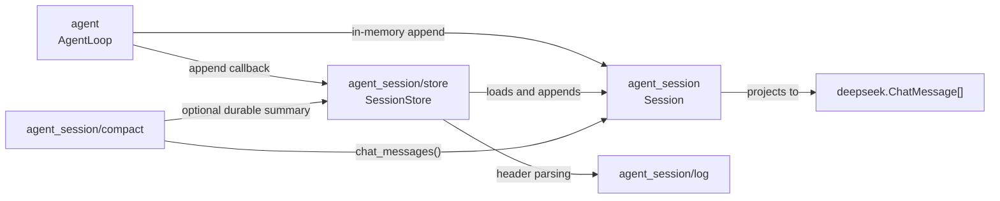
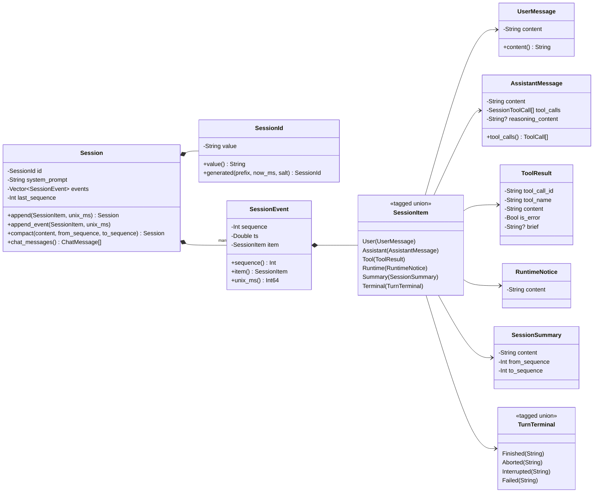
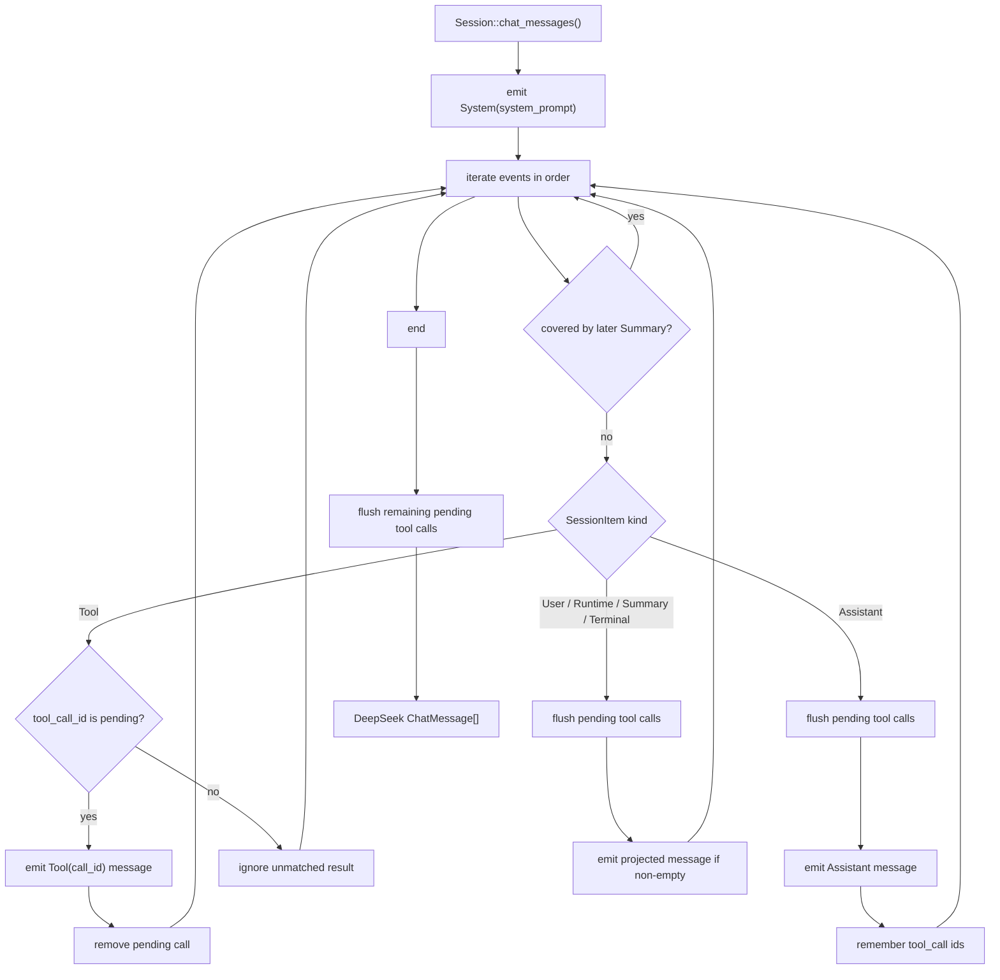
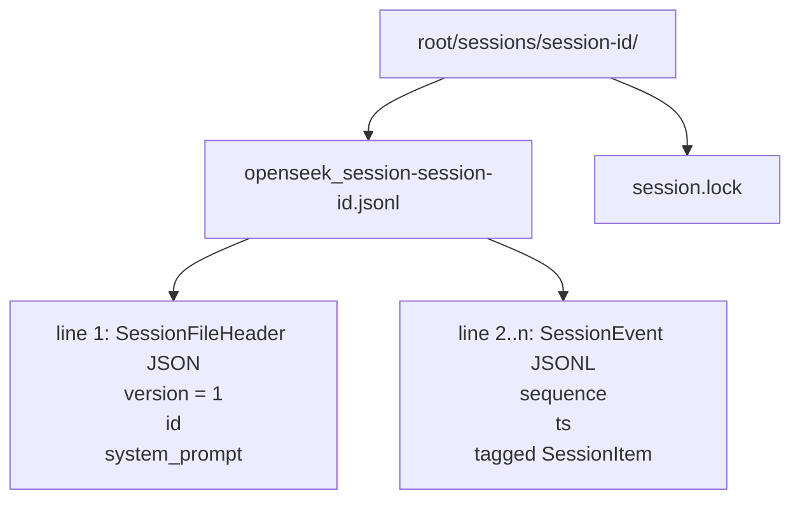
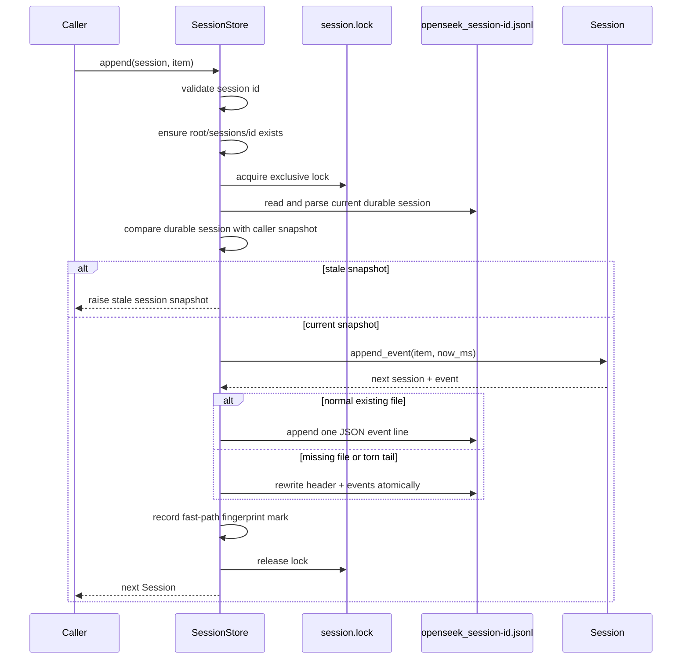

# OpenSeek Agent Session

`bobzhang/openseek/agent_session` is the typed, provider-aware conversation
state for resumable OpenSeek agents. It owns the durable event log and the
projection from that log into DeepSeek chat messages.

It is intentionally separate from the TUI transcript model. A `Session` is the
canonical process-independent record of what happened; the TUI transcript is a
rendering concern optimized for terminal display.

## Data Model

The root value is an immutable `Session`:

- `SessionId`: stable id for a persisted conversation.
- `system_prompt`: fixed prompt captured when the session is created.
- `events`: append-only `SessionEvent` values in log order.
- `last_sequence`: highest event sequence, or `0` for an empty session.

Each event has a one-based monotonic sequence number, a unix-millisecond
timestamp, and one `SessionItem` payload:

- `User`: user-authored prompt or steering text.
- `Assistant`: model output, including native DeepSeek tool calls and optional
  reasoning content.
- `Tool`: local tool result for one assistant tool call.
- `Runtime`: runtime notice injected into model context, such as a plan reminder.
- `Summary`: durable compaction record for a covered event range.
- `Terminal`: how a turn ended: finished, aborted, interrupted, or failed.

Appending never mutates the receiver. It returns a new session that shares the
old log structure.

## Architecture Diagrams

The package split keeps the pure session model separate from native persistence
and agent runtime concerns:



The core data model is an immutable session with an append-only event log.
`SessionItem` and `TurnTerminal` are MoonBit enums with payloads, so the diagram
shows them as tagged unions instead of plain UML enumerations:



```mbt check
///|
test "append leaves the original session unchanged" {
  let session = @agent_session.Session(
    SessionId("example"),
    system_prompt="system",
  ).append(User(UserMessage("hello")))
  debug_inspect(
    session,
    content=(
      #|{
      #|  id: { value: "example" },
      #|  system_prompt: "system",
      #|  events: <Vector: [{ sequence: 1, ts: 0, item: User({ content: "hello" }) }]>,
      #|  last_sequence: 1,
      #|}
    ),
  )
}
```

Call `append_event` when the caller also needs the assigned `SessionEvent`, for
example before appending it to an on-disk JSONL log:

```mbt check
///|
test "append_event returns the durable event" {
  let session = @agent_session.Session(SessionId("s1"), system_prompt="system")
  let (next, event) = session.append_event(User(UserMessage("hello")))
  debug_inspect(next.last_sequence(), content="1")
  debug_inspect(
    event,
    content=(
      #|{ sequence: 1, ts: 0, item: User({ content: "hello" }) }
    ),
  )
}
```

## Model Projection

`Session::chat_messages` converts the durable session into the exact DeepSeek
messages sent to the model. Projection is where session-specific repair and
compaction rules are applied:

- The first message is always the stored system prompt.
- `User` and `Runtime` events become user messages.
- `Assistant` events preserve visible content, reasoning content, and native
  tool calls.
- `Tool` events are emitted only when they answer a pending assistant tool call.
- `Terminal(Finished(...))` becomes a final assistant message when non-empty;
  failed, aborted, and interrupted terminals become assistant-status messages.
- A dangling assistant tool call is closed with a synthetic tool error before
  the next non-tool event, keeping the protocol-valid replay shape.



```mbt check
///|
test "project a session into DeepSeek messages" {
  let call = @deepseek.ToolCall(
    id="call_1",
    name="read",
    arguments="{\"path\":\"README.md\"}",
  )
  let session = @agent_session.Session(SessionId("s1"), system_prompt="system")
    .append(User(UserMessage("inspect")))
    .append(Assistant(AssistantMessage("", tool_calls=[call])))
    .append(
      Tool(
        ToolResult(tool_call_id="call_1", tool_name="read", content="README"),
      ),
    )
    .append(Terminal(Finished("done")))

  let messages = session.chat_messages()
  debug_inspect(
    messages,
    content=(
      #|[
      #|  {
      #|    role: System,
      #|    content: "system",
      #|    tool_calls: [],
      #|    reasoning_content: None,
      #|  },
      #|  {
      #|    role: User,
      #|    content: "inspect",
      #|    tool_calls: [],
      #|    reasoning_content: None,
      #|  },
      #|  {
      #|    role: Assistant,
      #|    content: "",
      #|    tool_calls: [{ id: "call_1", name: "read", arguments: "{\"path\":\"README.md\"}" }],
      #|    reasoning_content: None,
      #|  },
      #|  {
      #|    role: Tool("call_1"),
      #|    content: "README",
      #|    tool_calls: [],
      #|    reasoning_content: None,
      #|  },
      #|  {
      #|    role: Assistant,
      #|    content: "done",
      #|    tool_calls: [],
      #|    reasoning_content: None,
      #|  },
      #|]
    ),
  )
}
```

## Compaction

Compaction is append-only. `Session::compact` validates a source event range and
appends a `Summary` event; it does not delete or rewrite the raw event log.

Later, `Session::chat_messages` skips older events covered by a later summary
and emits the summary as a user message:

```text
[conversation summary]
source_events=<from>..<to>
<summary text>
```

```mbt check
///|
test "summary replaces covered events in model projection only" {
  let session = @agent_session.Session(SessionId("s1"), system_prompt="system")
    .append(User(UserMessage("old user")))
    .append(Assistant(AssistantMessage("old assistant")))
    .compact(
      content="old user and assistant discussed README",
      from_sequence=1,
      to_sequence=2,
    )
  debug_inspect(
    session,
    content=(
      #|{
      #|  id: { value: "s1" },
      #|  system_prompt: "system",
      #|  events: <Vector:
      #|    [
      #|      { sequence: 1, ts: 0, item: User({ content: "old user" }) },
      #|      {
      #|        sequence: 2,
      #|        ts: 0,
      #|        item: Assistant({ content: "old assistant", tool_calls: [], reasoning_content: None }),
      #|      },
      #|      {
      #|        sequence: 3,
      #|        ts: 0,
      #|        item: Summary(
      #|          {
      #|            content: "old user and assistant discussed README",
      #|            from_sequence: 1,
      #|            to_sequence: 2,
      #|          },
      #|        ),
      #|      },
      #|    ]>,
      #|  last_sequence: 3,
      #|}
    ),
  )
  let messages = session.chat_messages()
  debug_inspect(
    messages,
    content=(
      #|[
      #|  {
      #|    role: System,
      #|    content: "system",
      #|    tool_calls: [],
      #|    reasoning_content: None,
      #|  },
      #|  {
      #|    role: User,
      #|    content: "[conversation summary]\nsource_events=1..2\nold user and assistant discussed README",
      #|    tool_calls: [],
      #|    reasoning_content: None,
      #|  },
      #|]
    ),
  )
}
```

## JSON And Storage

This package provides JSON round-tripping for `Session`, `SessionId`,
`SessionEvent`, and all session item variants. The nested native package
`bobzhang/openseek/agent_session/store` owns filesystem persistence.

The store layout is:

```text
<root>/sessions/<session-id>/
  openseek_session-<session-id>.jsonl
  session.lock
```

`openseek_session-<session-id>.jsonl` holds the whole session: a header record
(`{"version":1,"id":...,"system_prompt":...}`) on the first line, then one
append-only event per line. Loading replays the event lines into a `Session`.



Use the store for durable callers:

- `SessionStore::create`: write a complete session, replacing prior contents.
- `SessionStore::append`: append one item with a current timestamp.
- `SessionStore::compact`: append a validated summary event.
- `SessionStore::load`: replay a persisted session.
- `SessionStore::listings`: list ids with last-activity and first-prompt
  metadata.

## Runtime Flow

The `agent` package appends session events as the loop progresses:

1. The user task is appended as `User`.
2. Runtime notices may be appended as `Runtime`.
3. Model responses are appended as `Assistant`.
4. Tool executions are appended as `Tool`.
5. The turn closes with one `Terminal`.

The CLI and TUI decide whether those appends are in memory or durable. For
durable sessions, they pass an append callback backed by `SessionStore::append`
into the agent loop.



## Public API Surface

The package exposes:

- `SessionId` and immutable `Session`.
- `SessionEvent` sequence numbers backed by an immutable vector.
- Typed `SessionItem` variants for users, assistants, tool results, runtime
  notices, summaries, and turn terminal states.
- JSON round-tripping for durable storage.
- `Session::append_event` for callers that need the new session and appended
  event without scanning the whole log.
- `Session::chat_messages` for model projection.
- `Session::compact` for validated summary append.

```mbt check
///|
test "session JSON round-trips events" {
  let session = @agent_session.Session(SessionId("s1"), system_prompt="system")
    .append(User(UserMessage("hello")))
    .append(Terminal(Finished("done")))

  let decoded : @agent_session.Session = @json.from_json(session.to_json())
  debug_inspect(
    decoded,
    content=(
      #|{
      #|  id: { value: "s1" },
      #|  system_prompt: "system",
      #|  events: <Vector:
      #|    [
      #|      { sequence: 1, ts: 0, item: User({ content: "hello" }) },
      #|      { sequence: 2, ts: 0, item: Terminal(Finished("done")) },
      #|    ]>,
      #|  last_sequence: 2,
      #|}
    ),
  )
}
```
