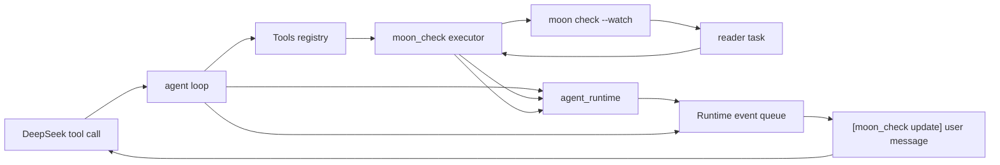

# Agent Tool

This package defines OpenSeek's local tool boundary: parsed tool calls, tool
definitions, executor wrappers, registries, typed output, and explicit
agent-loop control actions.

Concrete built-in tools live in subpackages:

- `agent_tool/read`
- `agent_tool/edit`
- `agent_tool/write`
- `agent_tool/shell`
- `agent_tool/moon_check`
- `agent_tool/moon_cmd`
- `agent_tool/moon_ide`
- `agent_tool/finish`

## API Shape

- `AgentToolCall(@deepseek.ToolCall)`: parse DeepSeek's raw tool-call argument
  string into local JSON arguments.
- `AgentToolDefinition(name~, description~, schema~, execute~)`: define one local
  tool and its executor.
- `ToolExecutor`: wrap synchronous or asynchronous executors.
- `ToolOutput(content, is_error?)`: normal tool output sent back to the model.
- `ToolAction`: either `Respond(ToolOutput)` or `Control(AgentControl)`.
- `AgentControl`: loop-level control such as `Finish(answer)` or
  `Abort(reason)`.
- `Tools(definitions)`: name-indexed registry with duplicate-name validation.

Tool output errors are typed with `is_error=true`, but the output content is
still sent to the model so it can recover. Control actions are not sent back as
tool messages; the host loop handles them directly.

## Design Rationale

The tool layer is intentionally small and typed because the model-facing tool
protocol and the host agent loop have different concerns. DeepSeek tool calls
arrive as raw JSON argument strings with provider-specific ids, while local
executors need parsed arguments, local validation, and explicit control over
whether the loop should continue.

`ToolAction` separates normal tool responses from loop control. Most tools
return `Respond(ToolOutput(...))`, including failures, so the model can inspect
the error and recover in the next step. `finish` returns `Control(Finish(...))`
so ending the run is a host-loop decision rather than another message the model
has to interpret.

Stateful tools use `agent_runtime` directly when they need loop-scoped
background work or event updates. For example, `moon_check` owns its watcher
state, internal runtime events, and event rendering in its own package; its
direct tool results still follow the normal `Respond(ToolOutput(...))`
contract.



Each concrete tool is a subpackage to keep the root package focused on the
shared contract: parsing calls, advertising JSON schemas, dispatching tools,
and representing typed output. This also makes it cheap to test or replace one
tool without changing the registry or the agent loop.

Concrete tools split execution into two explicit steps. Internal `decode`
packages convert raw `Json` arguments into typed input records with focused
validation tests. The tool package then turns that typed input into a
`ToolAction`, keeping filesystem, process, and control-flow behavior separate
from argument parsing.

## API Style

Tool APIs use object-shaped JSON arguments with explicit field names. Required
fields are validated inside each tool, and invalid arguments are returned as
`ToolOutput(..., is_error=true)` instead of raising through the agent loop.

Tool responses are plain text by design. The agent log and model transcript
should show the same diagnostic text a developer would use while debugging:
command line, exit status, compiler output, file metadata, or a concise write
confirmation. When a tool needs structured behavior, the structure is in the
schema and the output header, not in hidden host state.

Control actions are reserved for loop state transitions. Normal tools should
not stop the agent; they should report enough information for the next model
step to decide what to do.

```moonbit check
///|
test "tool action helpers" {
  let response = @agent_tool.ToolAction::respond("ok")
  guard response is Respond(output) else { fail("expected Respond") }
  assert_eq(output.content, "ok")
  assert_false(output.is_error)

  let failed = @agent_tool.ToolAction::respond("bad", is_error=true)
  guard failed is Respond(error_output) else { fail("expected Respond") }
  assert_eq(error_output.content, "bad")
  assert_true(error_output.is_error)

  let done = @agent_tool.ToolAction::finish("done")
  guard done is Control(Finish(answer)) else { fail("expected Finish") }
  assert_eq(answer, "done")
}
```
