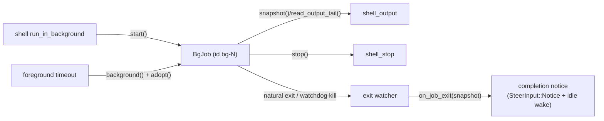

# Background Job Registry

`bobzhang/openseek/agent_tool/bgjobs` is the session-scoped registry of
background shell jobs. Each job wraps one shared
`@shell_exec.ShellExecution` (see `agent_tool/shell_exec`): the registry adds
ids, session-visible metadata, spill-file placement, exit watchers, and
push-completion hooks — it adds no second execution or output pipeline.

One `BgJobRuntime` is created per session (by `@agent.build_tools`) and shared
by the `shell` (`run_in_background`), `shell_output`, and `shell_stop` tools, so
a job started in one turn is visible in every later turn of the session.

## Lifecycle

- `start` spawns a job directly (one id reserved up front, so the job id and
  its spill file never diverge).
- `adopt` registers an *already running* execution — this is detach-on-timeout:
  a foreground command that outlived its `timeout_ms` is flipped to
  `Backgrounded` and adopted, so `shell_output`/`shell_stop` and the completion
  notice see it like any explicitly backgrounded job. The launch's sandbox
  metadata rides along so a source-write denial is still detected when the
  job's output is read later.
- Every child is spawned on the session task group: session teardown cancels
  the process. Cancellation reaches only the direct child (no process-group
  kill), so a daemonizing command can leave descendants.

## Output retention

Jobs use the sink's file-backed model: an inline preview up to the budget
(`max_output_chars`, matching the shell tool's foreground default so a command
reads the same either way), full output in a per-job spill file under the
session's spill directory, and the hard-cap watchdog: a job that floods past
`hard_output_cap` (default 20M characters) is killed and reported as
`killed_by_output_limit` — never left burning CPU with its output dropped, and
never silently dead. Without a spill directory the runtime degrades to
memory-only jobs (bounded preview, rest dropped).

## Push-completion

The per-job watcher awaits the execution and calls `on_job_exit` exactly once
when the job ends *on its own* — a natural exit, or the output watchdog. A
requested stop (`shell_stop`, session teardown) fires nothing: it is already
user-visible. The `agent` package wires `on_job_exit` to queue a
`SteerInput::Notice` (lossless) and poke the serve loop, which is what makes
job completion *push* into the conversation instead of requiring the model to
poll — see the `shell` tool description and the system prompts, which teach
exactly that workflow.

## Snapshots

Consumers only ever see `BgJobSnapshot`, an immutable view carrying the status
(`Running`/`Exited(code)`/`Stopped`), the inline output preview, size and
sequence counters for change detection, and the error-semantics flags
(`had_invalid_utf8`, sandbox metadata, `killed_by_output_limit`) that let
`shell_output` report a background job with exactly the foreground path's error
behavior.
