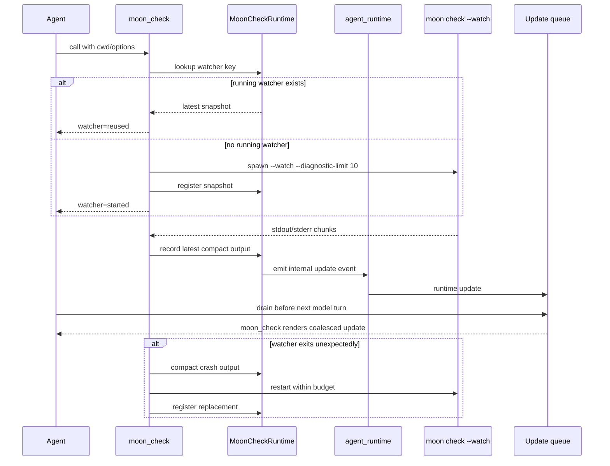

# Moon Check Tool

`moon_check` starts or reuses a session-scoped
`moon check --watch --diagnostic-limit 10` watcher and returns the latest merged
stdout/stderr snapshot. It is a focused validation tool for
MoonBit work: use it when the agent needs compiler feedback without going
through `sh -c` or manually polling one-shot checks.

## Design Rationale

`moon_check` exists separately from `shell` because compiler diagnostics are the
tightest feedback loop in MoonBit work. It always runs
`moon check --watch --diagnostic-limit 10`, which gives the agent fresh textual
compiler context without depending on a shell pipeline or manual polling. The
diagnostic limit keeps early broken-project states from flooding the
conversation with a large compiler wall. The first call for a given cwd/options
tuple starts a workspace watcher; later calls with the same tuple reuse the
existing watcher and return the latest snapshot.
If the underlying `moon --watch` process exits unexpectedly, `moon_check`
compacts the crash output and automatically starts a replacement watcher for
the same tuple, up to a small restart budget. This keeps compiler feedback
flowing during long agent runs while avoiding repeated crash-banner dumps in
the model context.

The schema is intentionally narrow. It accepts MoonBit check options that affect
diagnostics, but it does not expose unrelated `moon` subcommands. That narrow
shape nudges the agent to check early and often while keeping compile feedback
separate from tests, CLI runs, formatting, and interface generation.



## API Style

Use `moon_check` once at the start of an iterative MoonBit edit loop, especially
after creating or editing a package file:

```json
{
  "cwd": "/tmp/example_project",
  "target": "native"
}
```

Use `warn_list` or `deny_warn` when the task requires stricter cleanup. The
agent may call `moon_check` again to inspect the current watcher state; the call
does not start a duplicate watcher for the same arguments. If an earlier
watcher stopped, the next call starts a replacement. Use `shell` for one-shot
`moon` commands such as `moon test`, `moon run`, `moon info`, `moon fmt`, or
user-facing command validation.

## Arguments

| Name | Type | Required | Notes |
| --- | --- | --- | --- |
| `cwd` | string | no | Working directory. Empty is treated as missing. |
| `target` | string | no | `wasm`, `wasm-gc`, `js`, `native`, `llvm`, or `all`. |
| `warn_list` | string | no | Value passed to `--warn-list`. |
| `deny_warn` | boolean | no | Adds `--deny-warn` when true. |
| `fmt` | boolean | no | Adds `--fmt` when true. |
| `explain` | boolean | no | Adds `--explain` when true. |

## Action

The action is always `Respond(ToolOutput(...))`. `is_error` is true when the
latest watcher snapshot has compiler errors, when argument validation fails, or
when the process cannot be launched. The string body has one of these shapes:

- `"cwd=<cwd>\ncommand=moon check --watch --diagnostic-limit 10 ...\nwatcher=<started|reused|restarted>\nid=<id>\nstatus=<running|stopped>\nseq=<n>\n<output>"`.
- Restarted watchers also include `restart_count`, `restart_limit`, and
  `restart_reason`. Crash summaries use a compact
  `[moon_check watcher exited]` block instead of forwarding the full `moon`
  panic banner.
- `"error running moon_check: <error>"`.
- `"error: moon_check requires <field description>"`.

## Example

```moonbit check
///|
async test "moon_check tool advertises the expected schema" {
  @async.with_task_group() <| group => {
    let tool = @moon_check.definition(AgentRuntime(), AgentTaskScope(group))
    assert_eq(tool.name, "moon_check")
    let JsonSchema(schema) = tool.schema
    let text = schema.stringify()
    assert_false(text.contains("\"path\""))
    assert_true(text.contains("\"target\""))
  }
}
```

Process execution is intentionally not exercised from doc tests: running
`moon check` against the active package from inside `moon test` can contend with
the active build. The real-world unit tests copy fixture projects into `/tmp`
and run `moon_check` there, covering both a valid project and a broken project
that emits compiler diagnostics.
