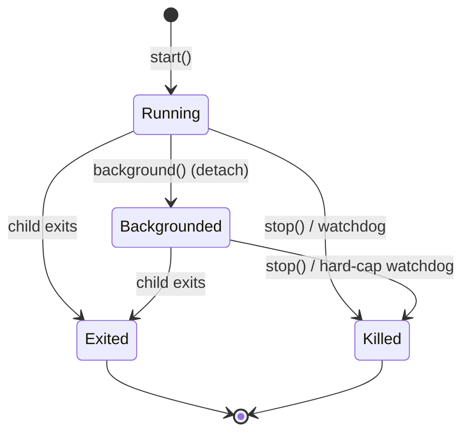
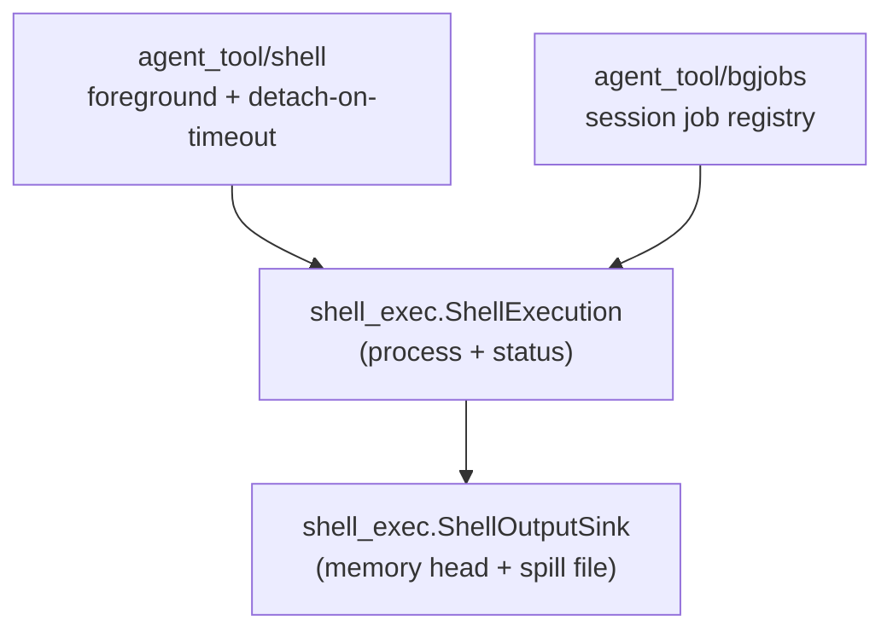

# Shell Execution Model

`bobzhang/openseek/agent_tool/shell_exec` is the shared execution model behind
every shell command the agent runs: one process, one output owner, one status
flag. It is the foundation the `shell`, `shell_output`, and `shell_stop` tools
(and the `bgjobs` registry) are built on.

The package deliberately contains no tool definitions and no policy about what
commands may run — it only answers "what is a running shell command, who owns
its output, and how does it end".

## The One Idea

**"Background" is a status, not a place.** A `ShellExecution` is a process
spawned on the session task group plus a single `ShellOutputSink` plus an
`ExecStatus`. Foreground vs background is only whether a tool call is currently
awaiting the execution — so moving a command to the background
(detach-on-timeout) is a status flip (`background()`), not a re-route between
two output pipelines. An earlier design that routed timed-out foreground
commands into a separate background system died on irreducible mismatches
(prefix-vs-tail retention, cancel-vs-keep-running, notify-vs-not); with one
execution object those questions cannot arise.

## L0 — `ShellOutputSink`: memory-first, file-backed output

The sink is the single owner of a command's merged stdout+stderr, with one
retention story so foreground and background can never disagree:

- The first `inline_cap` characters are kept in memory (the *head*) for cheap
  inline rendering.
- Past the inline cap, the **full** output spills to a per-execution file
  (`spill_path`), seeded with the head. The file is the source of truth, so
  *retention is a read-time decision* — `head()`, `read_tail(n)`, or
  `read_all()` — instead of a policy baked into the buffer at write time.
- Past `hard_cap` (default 20M characters) further output is dropped and
  `truncated` is set; the execution-level watchdog is expected to kill the
  child at that point (see below).
- Without a `spill_path` the sink is memory-only: head kept, rest dropped —
  used by contexts that never need full large output.

Byte streams are decoded incrementally and UTF-8-safely: an incomplete trailing
sequence is carried to the next chunk, and any genuinely invalid bytes set
`had_invalid_utf8` so a consumer can preserve the strict-decode "binary output"
error instead of silently presenting replacement characters as success.

## L1 — `ShellExecution`: process + sink + status

`ShellExecution::start` spawns the child on the session task group (so session
teardown cancels it) and starts a monitor task. The monitor's design point:
**draining the pipe and awaiting the exit are decoupled.** Coupling them (read
to EOF, then wait) hangs forever when the child exits but a descendant it
spawned still holds the pipe open — so a concurrent reader drains bytes while
`process.wait()` is the authoritative exit signal, followed by a short drain
grace and a forced close.

Two output-limit watchdogs, two thresholds (plus a wall-clock lifetime kill:
`kill_for_time_limit`, driven by the bgjobs reaper, records
`killed_by_time_limit` the same way):

- `kill_when_full` (foreground): kill as soon as output exceeds the *inline*
  cap, so a chatty command is an immediate output-limit error rather than
  running to its timeout. Cleared by `background()` — a job detached while
  still under the limit may keep growing.
- `kill_at_hard_cap` (background): kill once full output hits the *hard* cap —
  past it every byte is dropped, so a flooding job would burn CPU producing
  nothing readable. Deliberately survives `background()`: detached means
  unbounded in time, not unbounded in output. A watchdog kill records
  `killed_by_output_limit` so it is surfaced, never silent.

Cancellation notes: `request_stop()` is synchronous (safe to call while a turn
is being cancelled, where awaiting is not), and cancellation reaches only the
directly spawned process — the process library exposes no process-group kill,
so a command that daemonizes children can leave descendants running.

## Layering

See `docs/plans/shell-execution-model.md` for the full architecture narrative,
and `agent_tool/bgjobs` for the session-scoped registry built on this model.
