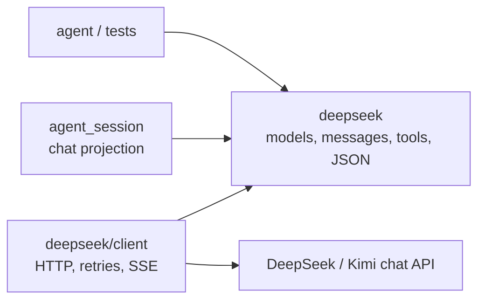
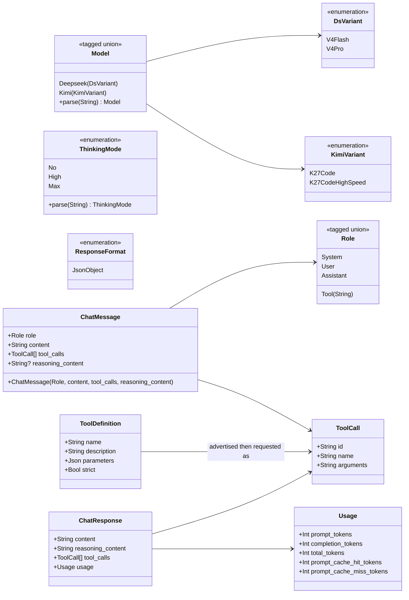
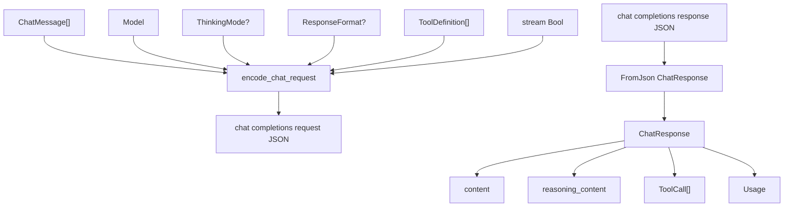
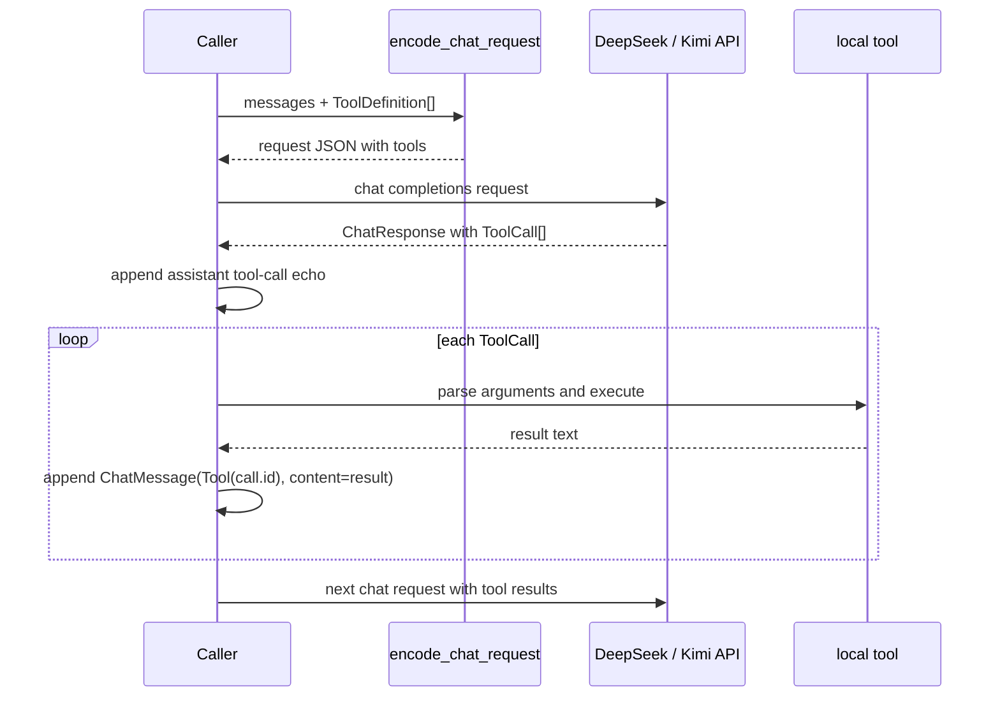

# DeepSeek Chat Data

This pure package provides strongly typed DeepSeek chat data and JSON
encoding/decoding. Use it when constructing requests, parsing responses, or
testing DeepSeek chat behavior without network access. The typed model list
also covers Kimi K2.7 Code models where their request policy differs from
DeepSeek's.

The HTTP client lives in `bobzhang/openseek/deepseek/client`.

## API Shape

- `Model`: provider-tagged chat models, e.g. `Deepseek(V4Pro)` and
  `Kimi(K27Code)`, with `Show` for wire strings and `Debug` for inspection.
- `ThinkingMode`: typed control for DeepSeek V4 thinking (`No`, `High`, or
  `Max`).
- `Role`: `System`, `User`, `Assistant`, and `Tool(tool_call_id)`, with `Show`
  for wire strings and `Debug` for inspection.
- `ChatMessage(role, content=..., tool_calls?, reasoning_content?)`: one typed
  chat message constructor. Use `Assistant` with `tool_calls` for the assistant
  message that must be sent back after DeepSeek requests native tool calls.
- `ResponseFormat`: optional assistant content constraint. Leave absent for
  normal text; pass `JsonObject` only when the assistant content must be a JSON
  object.
- `encode_chat_request(tools?, thinking?, stream?, response_format?,
  model?=Deepseek(V4Pro)) <| messages`: builds the full DeepSeek chat completions request
  body. Streaming requests include usage-bearing stream options. Kimi K2.7 Code
  requests omit DeepSeek-specific thinking fields and preserve assistant
  `reasoning_content`. The per-value
  encoders for messages, tool definitions, and tool calls are package-private
  implementation details.
- `ToolDefinition(name, description, parameters, strict?)`: a native DeepSeek
  function tool definition with a JSON Schema parameters object.
- `ToolCall(id~, name~, arguments~)`: a decoded function call request from the
  model; `arguments` is the raw JSON string from the API.
- `Usage` and `ChatResponse`: decoded response values with `Debug`; responses
  include `reasoning_content` and `tool_calls`. `ChatResponse` implements
  `FromJson` for DeepSeek chat completions response envelopes.

## Architecture Diagrams

The root `deepseek` package is pure data plus JSON encoding/decoding. The
effectful HTTP transport lives one package down in `deepseek/client`.



The core API is a set of public data types around chat request and response
shapes. In this diagram, `+` marks public fields or constructors, and tagged
unions correspond to MoonBit enum constructors.



`encode_chat_request` is the main pure request boundary. `ChatResponse` and
`Usage` decode response JSON back into typed values.



## Native Tool Calls

DeepSeek tool calling uses the same flow described in the
[official API docs](https://api-docs.deepseek.com/guides/tool_calls): send
`tools` with a chat request, read `response.tool_calls`, append the assistant
tool-call message, execute each local function, then append
`ChatMessage(Tool(call.id), content=result)` before the next request.

### `ToolDefinition` vs `ToolCall`

`ToolDefinition` and `ToolCall` are opposite sides of the same protocol step:

| Type             | Direction                                                                | Meaning                                                                                                                    |
| ---------------- | ------------------------------------------------------------------------ | -------------------------------------------------------------------------------------------------------------------------- |
| `ToolDefinition` | Your code sends it to DeepSeek through `Client::chat(..., tools=[...])`. | A tool definition: name, description, and JSON Schema for arguments. It advertises a function the model may request later. |
| `ToolCall`       | DeepSeek returns it in `ChatResponse.tool_calls`.                        | A concrete tool invocation request: generated call id, function name, and raw JSON argument string.                        |

The usual sequence is:

1. Define available tools with `ToolDefinition(...)`.
2. Send them with `Client::chat(..., tools=[...])`.
3. Decode DeepSeek's response into `ToolCall` values.
4. Append `ChatMessage(Assistant, content=response.content,
   tool_calls=response.tool_calls)` so the conversation records the model's
   requested calls.
5. Execute each local function after parsing `ToolCall.arguments`.
6. Append each result as `ChatMessage(Tool(call.id), content=result)`.



```moonbit check
///|
test "encode chat request values" {
  let body = @deepseek.encode_chat_request(model=Deepseek(V4Flash)) <| [
    ChatMessage(User, content="write a MoonBit test"),
  ]
  json_inspect(body, content={
    "model": "deepseek-v4-flash",
    "messages": [{ "role": "user", "content": "write a MoonBit test" }],
    "stream": false,
  })
}
```

```moonbit check
///|
test "encode tool-enabled chat request" {
  let body = @deepseek.encode_chat_request(
    model=Deepseek(V4Flash),
    tools=[
      ToolDefinition("read", "Read a file.", {
        "type": "object",
        "properties": { "path": { "type": "string" } },
        "required": ["path"],
      }),
    ],
  ) <| [
    ChatMessage(User, content="read README.mbt.md"),
    ChatMessage(Assistant, content="", tool_calls=[
      ToolCall(
        id="call_1",
        name="read",
        arguments="{\"path\":\"README.mbt.md\"}",
      ),
    ]),
  ]
  json_inspect(body, content={
    "model": "deepseek-v4-flash",
    "messages": [
      { "role": "user", "content": "read README.mbt.md" },
      {
        "role": "assistant",
        "content": null,
        "tool_calls": [
          {
            "id": "call_1",
            "type": "function",
            "function": {
              "name": "read",
              "arguments": "{\"path\":\"README.mbt.md\"}",
            },
          },
        ],
      },
    ],
    "stream": false,
    "tools": [
      {
        "type": "function",
        "function": {
          "name": "read",
          "description": "Read a file.",
          "parameters": {
            "type": "object",
            "properties": { "path": { "type": "string" } },
            "required": ["path"],
          },
        },
      },
    ],
  })
}
```

```moonbit check
///|
test "encode json-object response request" {
  let body = @deepseek.encode_chat_request(
    model=Deepseek(V4Flash),
    response_format=JsonObject,
  ) <| [
    ChatMessage(User, content="return {\"ok\":true}"),
  ]
  json_inspect(body, content={
    "model": "deepseek-v4-flash",
    "messages": [{ "role": "user", "content": "return {\"ok\":true}" }],
    "stream": false,
    "response_format": { "type": "json_object" },
  })
}
```

```moonbit check
///|
test "decode chat response values" {
  let response : @deepseek.ChatResponse = @json.from_json({
    "choices": [{ "message": { "content": "ok" } }],
  })
  debug_inspect(
    response,
    content=(
      #|{
      #|  content: "ok",
      #|  reasoning_content: "",
      #|  tool_calls: [],
      #|  usage: {
      #|    prompt_tokens: 0,
      #|    completion_tokens: 0,
      #|    total_tokens: 0,
      #|    prompt_cache_hit_tokens: 0,
      #|    prompt_cache_miss_tokens: 0,
      #|  },
      #|}
    ),
  )
}
```

```moonbit check
///|
test "decode native tool call values" {
  let response : @deepseek.ChatResponse = @json.from_json({
    "choices": [
      {
        "message": {
          "content": null,
          "tool_calls": [
            {
              "id": "call_1",
              "type": "function",
              "function": {
                "name": "read",
                "arguments": "{\"path\":\"README.mbt.md\"}",
              },
            },
          ],
        },
      },
    ],
  })
  debug_inspect(
    response,
    content=(
      #|{
      #|  content: "",
      #|  reasoning_content: "",
      #|  tool_calls: [
      #|    {
      #|      id: "call_1",
      #|      name: "read",
      #|      arguments: "{\"path\":\"README.mbt.md\"}",
      #|    },
      #|  ],
      #|  usage: {
      #|    prompt_tokens: 0,
      #|    completion_tokens: 0,
      #|    total_tokens: 0,
      #|    prompt_cache_hit_tokens: 0,
      #|    prompt_cache_miss_tokens: 0,
      #|  },
      #|}
    ),
  )
}
```
