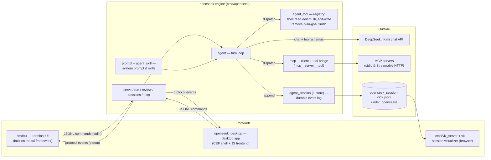
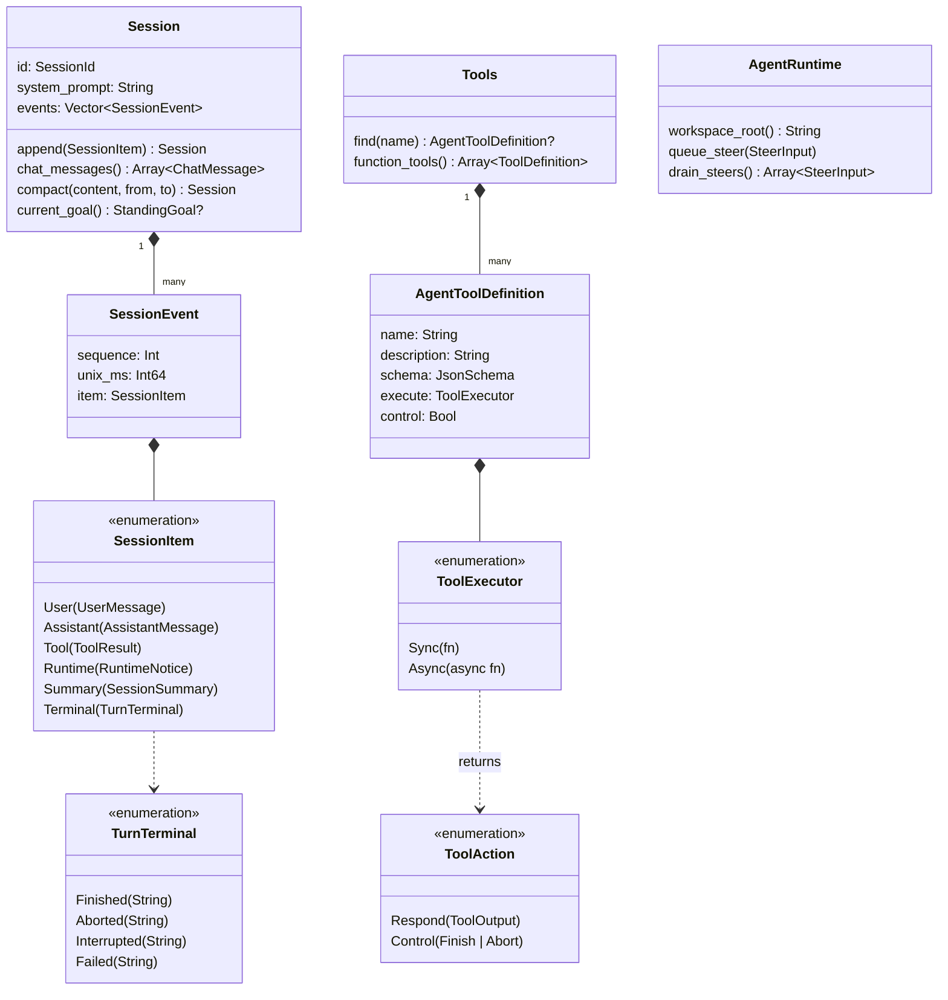
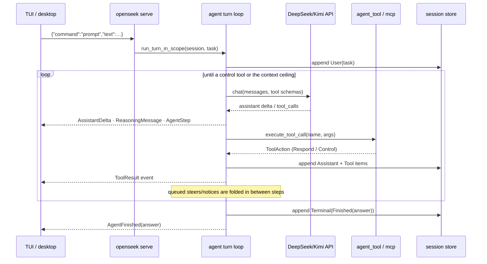

# OpenSeek Architecture

How the pieces fit together: the module map, the core data model, and the
life of one agent turn. Package-level details live in each package's README
(see the table in the [root README](../README.md)); this page is the map, not
the territory. Diagrams are [Mermaid](https://mermaid.js.org/), rendered
natively by GitHub.

## System overview

One binary, three frontends. `cmd/openseek` is the engine: its `serve` mode
reads JSONL commands on stdin and streams typed JSONL events
(`bobzhang/openseek_protocol`) on stdout. The terminal UI, the desktop app,
and headless `run` all drive that same engine and event stream. Durable state
lives in append-only session files that the visualizer reads directly.



The engine ↔ frontend wire contract is `bobzhang/openseek_protocol`: commands
in (`prompt`, `steer`, `cancel`, `compact`, `goal`), events out (steps,
deltas, tool results, goal/plan reminders, compaction, terminals). The
protocol module is backend-neutral so any frontend — including the JS ones —
can decode it; only `protocol/emit` (the writer) is native-only.

## Core data model

The durable log and the tool boundary are the two type families everything
else leans on.



Key invariants:

- **The session is the only memory.** `Session::chat_messages()` projects the
  event log into the provider's chat shape each turn; nothing conversational
  lives outside the log. Compaction rewrites a `[from, to]` range into one
  `Summary` item, and the projection starts from the latest summary.
- **Events are append-only and sequenced.** `SessionEvent.sequence` is
  contiguous; the store (`agent_session/store`) persists a header line plus
  one JSON event per line, so a torn final line is recoverable
  (`agent_session/log` reads leniently).
- **Tools are data.** A tool is a name, a JSON schema, and an executor.
  Normal tools return `Respond(ToolOutput)`; control tools (`finish`) end the
  turn via `Control`. MCP tools enter the same registry namespaced as
  `mcp__<server>__<tool>`, so the loop dispatches them identically.

## One turn, end to end

A `serve` turn as driven by the TUI (headless `run` is the same loop without
the stdin command pump):



Two pressure valves shape long turns:

- **Steps**: with `--max-steps` unset, a turn is bounded by the model's
  context window instead of a step count — when the window fills, the loop
  checkpoints (auto-compaction) and yields a `[context ceiling]` answer that
  the next turn continues from.
- **Steering**: `steer` commands and background-job completion notices are
  queued losslessly in `AgentRuntime` and surfaced to the model at the next
  step boundary, so a running turn can absorb new instructions without
  restarting.

## Where things live on disk

```text
.openseek/                       # per-workspace session root (--session-root)
  openseek_session-<id>.jsonl    # header line + append-only events
.openseek/skills/<name>.md       # workspace skills (shadow global ones)
~/.openseek/skills/              # global skill library (--global-skills-dir)
```

The visualizer (`openseek` sessions in a browser: `cmd/viz_server`) and
`sessions list` both read these files directly; nothing else is persisted.
